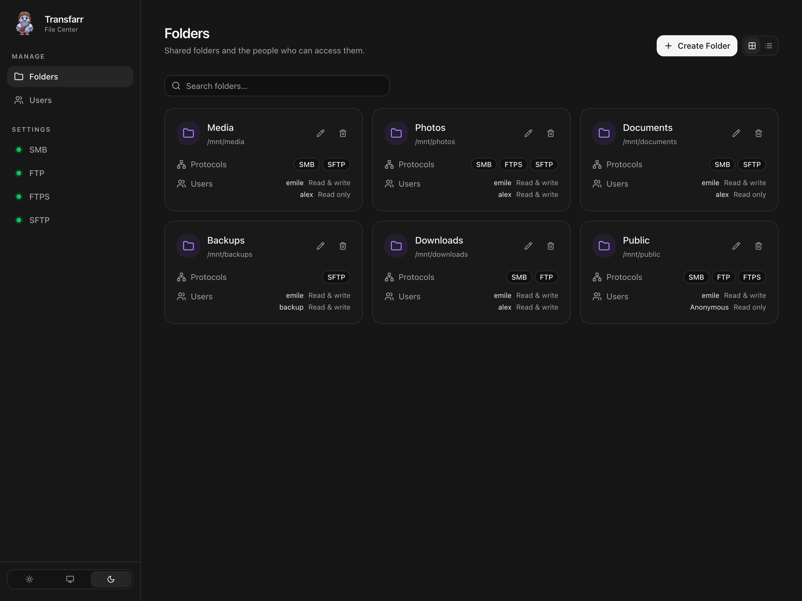

<p align="center">
  <a href="#getting-started"></a>
</p>
<h3 align="center">Transfarr</h3>
<p align="center">Share your files over SMB, FTP, FTPS &amp; SFTP — from one place.</p>

---

👋 **Welcome to Transfarr!** Transfarr includes everything you need to:

* Share folders using SMB (SMB2/3), FTP, FTPS, and SFTP.
* Create users and give them read-only or read/write access to each folder.
* Browse your filesystem and choose which protocols each folder uses.
* Discover available SMB shares directly from Finder or another SMB client.
* Configure ports and see whether services are online, unused, or have a port conflict.
* Inspect file protocol activity in **Debug → Logs**, including users, paths, client IPs, and results.
* Manage everything through a React + shadcn web interface based on [Containarr](https://github.com/Containarr/containarr).

> 💡 All four protocols run in the same Node.js process. Transfarr manages its own users; it does not create Linux accounts or run separate file-sharing daemons.

**Debug → Logs** records new FTP, FTPS, SFTP, and SMB actions, including login attempts, file operations, and failures. Search by user, action, path, or client IP; filter by protocol or result. Expand an entry to see its server path and protocol details. The latest 100,000 events persist in SQLite across restarts. Auto-refresh runs every five seconds on the newest page. Web UI actions, passwords, and file contents are excluded; activity from before logging was enabled is not available.

# Screenshots




[View more screenshots »](./screenshots)

# Requirements

* Docker Engine with Docker Compose and host networking.
* A directory containing the files you want to share, writable by the container's configured UID/GID.
* Port **3000** for the web interface, plus an available port for each sharing protocol you enable.

Linux supports Docker host networking directly. On [Docker Desktop](https://docs.docker.com/engine/network/drivers/host/), enable its host-networking feature. [OrbStack](https://docs.orbstack.dev/docker/network#host-networking) also supports host networking. For a native macOS run, see [Development](#development).

# Getting Started

Open a terminal or SSH session on your host device, in your Transfarr checkout.

## 1. Configure Transfarr

```bash
mkdir -p volumes/data volumes/mnt
cp .env.example .env
```

Edit `.env`:

* Set `PUID` and `PGID` to the user and group that own these directories. On Linux, use `id -u` and `id -g` to find your IDs.
* Set `TRANSFARR_PUBLIC_HOST` to your server's reachable IP address or DNS name for passive FTP and FTPS connections. Keep `127.0.0.1` only when testing from the same host.

Place your shared files and folders in `./volumes/mnt`.

## 2. Run Transfarr

```bash
docker compose up -d --build
```

This builds the image locally and starts Transfarr using the included [docker-compose.yml](./docker-compose.yml).

> 💡 Your settings, accounts, certificates, and SSH host key are saved in `./volumes/data`. Your shared files stay in `./volumes/mnt`. Both directories are excluded from Git and Docker build contexts.

<details>
<summary>docker-compose.yml</summary>

```yaml
services:
  transfarr:
    image: ghcr.io/transfarr/transfarr:latest
    build: .
    restart: unless-stopped
    user: "${PUID:-1000}:${PGID:-1000}"
    network_mode: host
    cap_add:
      - NET_BIND_SERVICE
    environment:
      TRANSFARR_PUBLIC_HOST: "${TRANSFARR_PUBLIC_HOST:-127.0.0.1}"
      TRANSFARR_UMASK: "${TRANSFARR_UMASK:-0022}"
    volumes:
      - ./volumes/data:/data:rw
      - ./volumes/mnt:/mnt:rw
```

The included Compose file also exposes environment defaults for protocol ports. Saved ports in Settings take precedence over environment defaults.

The registry image is `ghcr.io/transfarr/transfarr:latest`. Once an image has been published, use `docker compose pull` followed by `docker compose up -d --no-build` to run it without building locally.

</details>

## 3. Open a Browser

Open [http://localhost:3000](http://localhost:3000), or `http://<ip-of-your-host>:3000` if Transfarr runs on another device.

The web interface opens directly. Put Transfarr behind your reverse proxy and configure access control there. To start sharing:

1. Open **Users** and create a file-sharing account with a username and password.
2. Open **Folders**, add a folder, and use the picker to select its path under `/mnt`.
3. Choose the users who can access it, their read-only or read/write permissions, and the protocols to enable. Check **Anonymous** to allow access without a password, with its own read-only or read/write permission.

File-sharing clients authenticate with the usernames and passwords created on the Users page. For folders with **Anonymous** enabled, choose anonymous/guest access in SMB clients, or use the username `anonymous` in FTP, FTPS, and SFTP clients (no password required). Anonymous clients see only folders explicitly granting anonymous access. Named users keep their own permissions.

## 4. Connect Your Clients

| Protocol | Default TCP port | Connection |
| --- | --- | --- |
| SMB2/3 | `445` | `smb://<host>` or `\\<host>` to browse permitted shares |
| FTP | `21` | FTP with passive mode |
| FTPS | `990` | FTP with **implicit TLS** and passive mode |
| SFTP | `22` | SFTP with your sharing username and password |
| FTP passive data | `50000–50009` | Used for directory listings and transfers |
| FTPS passive data | `50010–50019` | Used for directory listings and transfers |

FTP, FTPS, and SFTP show a root directory containing the user's permitted shares. SMB lets users select a share or connect directly to `smb://<host>/<ShareName>`.

Change ports under **Settings → SMB / FTP / FTPS / SFTP**. Leave the port field empty to use its default. If a change would disconnect connected clients, Transfarr asks for confirmation before saving. Cancelling keeps the current settings and connections. FTP and FTPS also have **Passive port start** and **Passive port end** fields. Each range is saved independently, checked for overlaps and occupied ports, and must be allowed through your firewall. Saved ranges take precedence over `TRANSFARR_PASSIVE_MIN`, which sets the initial FTP start and places the initial FTPS range ten ports later.

The sidebar shows **green** when a service is online, **grey** when no folders use it, and **red** for a conflict or service error. Services start when a folder enables them and stop when the last folder disables them.

# Architecture

Transfarr runs the web interface and all sharing protocols inside one Node.js process.

```text
Browser → React web interface → Transfarr administration

File-sharing client → SMB / FTP / FTPS / SFTP → Shared folders
                      └── One Node.js process ──┘
```

SMB uses an embedded Rust N-API module. FTP, FTPS, and SFTP use Node.js libraries. There is no separate SMB daemon, FTP daemon, or SSH server in the container.

Every filesystem operation uses the identity the container runs as: `PUID:PGID`, defaulting to `1000:1000`. Folder permissions are enforced by Transfarr; sharing users do not become system users.

# FAQ

**A port is already in use. Can I still use Transfarr?**

Yes. The web interface and other protocols remain available. Choose a free port in that protocol's Settings page, or stop the conflicting service and click **Save changes**. Changing to an occupied port leaves the existing listener unchanged. Host networking uses the configured ports directly, without Docker port mappings.

**Why can I log in to FTP but not list files?**

FTP uses a separate data connection for listings and transfers. Set `TRANSFARR_PUBLIC_HOST` to an address reachable by your client and allow the passive port range through any firewall. Transfarr keeps passive listeners open while the service is online and supports one simultaneous data transfer per port in each service’s configured range (ten per service by default).

**How do I connect to SMB from the same Mac running Transfarr?**

For a native macOS run, set the SMB port to **1445** and use `smb://127.0.0.1:1445`. Finder rejects same-Mac connections on ports 445 and 139.

The local runner also opens a port **445** compatibility listener for Apple's share-discovery client. It accepts only IPv4 loopback connections and forwards them to the same embedded SMB server. Conflicts appear in SMB Settings and the sidebar. If discovery is unavailable, use `smb://127.0.0.1:1445/<ShareName>` to connect directly. Set `TRANSFARR_SMB_DISCOVERY=false` to disable the compatibility listener.

**Are connections encrypted?**

Use **SFTP** or **FTPS** for encrypted file transfers. FTP is plaintext. FTPS creates a persistent self-signed certificate on first start; trust it in your client or supply your own certificate and key. SFTP keeps the same host key across restarts. Web administration has no built-in authentication; use your reverse proxy for HTTPS and access control.

**Who owns uploaded files?**

All protocols use the process UID/GID. With the default umask of `0022`, new files normally have mode `0644` and directories `0755`. Existing files retain their ownership and permissions. Transfarr does not switch Unix users or apply per-user `chmod`/`chown`; clients cannot change Unix ownership or mode. Host ACLs and setgid directories can affect filesystem inheritance.

**What happens when I change access or delete a shared folder?**

Editing users or shares disconnects active transfers so permission changes take effect. Clients can reconnect with their updated access. Removing a share from Transfarr does **not** delete its files. Folders without enabled protocols or any access grants are inaccessible.

**What should I back up?**

Back up both `./volumes/data` and `./volumes/mnt`. Stop Transfarr before taking a consistent backup or restoring these directories, and preserve their ownership and permissions.

Users, folders, permissions, and protocol settings are stored in `sqlite/db.sqlite` inside the data directory, using Sequelize as in Containarr. SQLite uses WAL journaling and transactional writes. Stop Transfarr before copying the data directory so the database and any WAL files form a consistent backup. Existing `transfarr.json` files are ignored; no data is migrated or imported.

Protect the entire data directory. Password verification uses scrypt; sharing passwords are additionally encrypted with AES-256-GCM for SMB authentication. Anyone with both the database and `secret.key` can recover sharing passwords. Sharing passwords are never returned by the API.

# Development

<details>
<summary>Local setup, configuration, testing, and deployment</summary>

## Local Setup

Use Node.js **24+** and Rust **1.95+** to build the native SMB module on Linux or macOS. Docker supplies the toolchains for container builds.

```bash
npm ci
npm --prefix frontend ci
npm run build:native
npm run build
docker compose stop transfarr
npm run start:local
```

The local runner reads `.env` and stores its SQLite database at `volumes/local-data/sqlite/db.sqlite`. The first start creates an empty database; subsequent starts reuse it. Nothing is imported from Docker or legacy JSON storage. Local and Docker configuration changes are independent, and shared files stay in `volumes/mnt`. Stop the local process before returning to Docker.

For development with watch mode, run `npm run dev` and `npm run dev:frontend` in separate terminals. These commands use the direct server defaults: `volumes/data` and `volumes/mnt`; they do not load `.env`. Set environment variables explicitly when using different paths or ports. Vite proxies API requests to port 3000.

The native SMB binding is required at startup. Outside Docker, the process needs permission to bind low ports, or you can select higher protocol ports. The Docker image grants Node.js `CAP_NET_BIND_SERVICE` so it can bind low ports under the configured numeric UID/GID.

## Configuration

Saved protocol ports take precedence over environment defaults.

| Environment variable | Purpose / default |
| --- | --- |
| `PUID`, `PGID` | Compose filesystem identity: `1000:1000` |
| `PORT` | Web interface: `3000` |
| `TRANSFARR_DATA_DIR` | Configuration directory: `/data` in Docker, `volumes/local-data` in the local runner |
| `TRANSFARR_ROOT` | Shared root: `/mnt` in Docker, `volumes/mnt` locally |
| `TRANSFARR_SMB_PORT` | Initial SMB port: `445` |
| `TRANSFARR_FTP_PORT` | Initial FTP port: `21` |
| `TRANSFARR_FTPS_PORT` | Initial FTPS port: `990` |
| `TRANSFARR_SFTP_PORT` | Initial SFTP port: `22` |
| `TRANSFARR_PASSIVE_MIN` | Start of the 20-port FTP/FTPS passive range: `50000` |
| `TRANSFARR_PUBLIC_HOST` | Address advertised for passive transfers: `127.0.0.1` |
| `TRANSFARR_UMASK` | File creation mask: `0022` |
| `TRANSFARR_TLS_CERT`, `TRANSFARR_TLS_KEY` | Paths to a supplied FTPS certificate and private key |
| `TRANSFARR_SMB_DISCOVERY` | Local macOS port 445 compatibility listener; enabled by the local runner |

For Docker, add variables not already exposed by [docker-compose.yml](./docker-compose.yml) to the service's `environment` section. Keep the administration data directory separate from the shared root.

FTP/SFTP reject symbolic links. SMB uses capability-based filesystem confinement to prevent links from escaping a share. Do not concurrently replace shared directory components with symlinks from another host process during FTP/SFTP operations.

## Tests

```bash
npm test
npm run build
docker build -t ghcr.io/transfarr/transfarr:test .
docker build -f Dockerfile.test -t transfarr-integration .
docker run --rm --sysctl net.ipv4.ip_unprivileged_port_start=1024 transfarr-integration
```

The integration image adds test clients for FTP, implicit FTPS, SFTP, and signed SMB. Tests cover transfers, permissions, invalid credentials, filesystem confinement, access revocation, protocol settings, ownership, and share discovery. Discovery coverage includes Unicode, empty lists, pagination, fragmented responses, malformed requests, and local listener lifecycle. Test clients are absent from the runtime image.

## Deployment and Dependencies

[The GitHub workflow](./.github/workflows/docker.yml) builds AMD64 and ARM64 images and publishes the combined `ghcr.io/transfarr/transfarr:latest` image on pushes to `main`. Publishing requires package-write permission in the `transfarr/transfarr` repository.

The UI is adapted from Containarr. Protocol dependencies are [ftp-srv](https://github.com/QuorumDMS/ftp-srv), [ssh2](https://github.com/mscdex/ssh2), and [rust-smb-server](https://github.com/paltaio/rust-smb-server). The SMB dependency is vendored at revision `4ce1981a2cdf4bf1e26a5b806376e9f6323e5234`, with Transfarr's authenticated SRVSVC share discovery and a committed Cargo lockfile. Discovery supports NetrShareEnum levels 0 and 1 with pagination. The embedded server does not provide AD, Kerberos, printer-sharing, or legacy SMB1 features.

</details>

See [CHANGELOG.md](./CHANGELOG.md) for changes.
